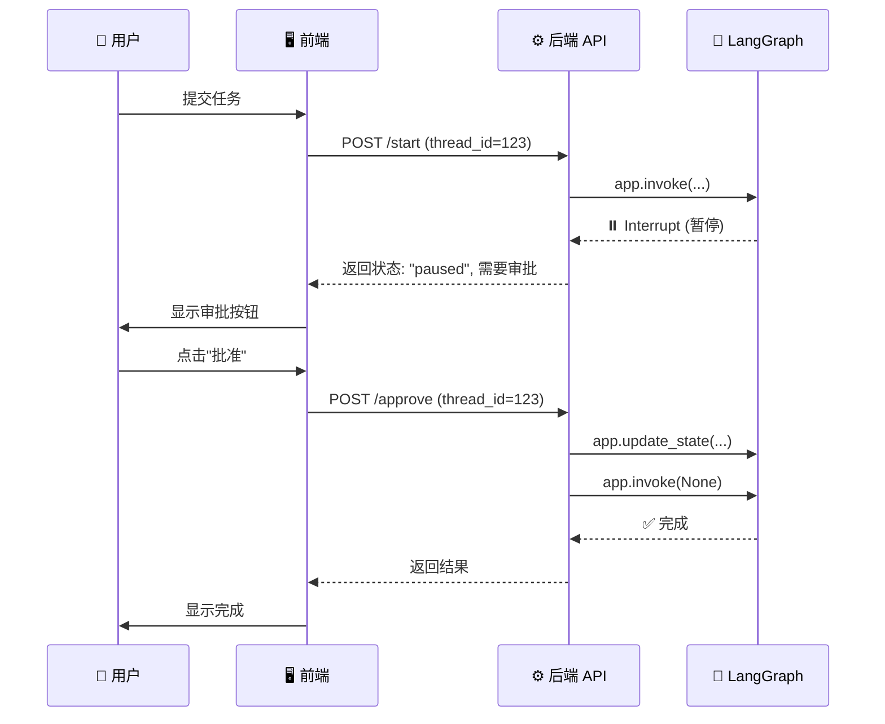

<script type="module">
  import mermaid from 'https://cdn.jsdelivr.net/npm/mermaid@10/dist/mermaid.esm.min.mjs';
  mermaid.initialize({ startOnLoad: true });
</script>

# LangGraph HITL 完全指南：从入门到精通人机协作工作流

## 📍 导航指南

根据你的需求，选择合适的阅读路径：

- 🎓 **新手？从这里开始** → [创建你的第一个 HITL 工作流](#tutorial) - 快速实现一个HITL
- 🛠️ **有具体问题？** → [掌握常见 HITL 场景的实现方法](#howto) - 快速找到解决方案
- 📚 **想深入理解？** → [HITL 的工作机制和设计哲学](#explanation) - HITL工作原理
- 📖 **需要查 API？** → [参考文档](#reference) - API 和模式参考

---

## 目录

### 第一部分：创建你的第一个 HITL 工作流 🎓
- [什么是 HITL？](#what-is-hitl)
- [创建你的第一个 HITL 工作流](#first-hitl)
- [运行和测试](#test-hitl)
- [理解三种暂停模式](#three-modes)

### 第二部分：掌握常见 HITL 场景的实现方法 🛠️
- [如何实现单级审批](#howto-single-approval)
- [如何实现多级审批](#howto-multi-approval)
- [如何处理审批拒绝](#howto-rejection)
- [如何使用 Stream 模式](#howto-stream)
- [如何调试 HITL 问题](#howto-debug)

### 第三部分：HITL 的工作机制和设计哲学 📚
- [HITL 工作机制详解](#deep-dive-mechanisms)
- [Checkpoint 持久化原理](#checkpoint-deep-dive)
- [设计哲学](#design-philosophy)
- [最佳实践](#best-practices)

### 第四部分：参考文档 📖
- [核心 API 参考](#api-reference)
- [状态管理模式](#state-patterns)
- [常见模式和反模式](#patterns)

### 附录
- [常见问题 FAQ](#faq)
- [生产环境部署](#production)

---

<a id="what-is-hitl"></a>
## 什么是 HITL？

**HITL (Human-in-the-Loop，人在回路中)** 是一种将人类智能有效集成到自动化系统中的设计模式。在 AI Agent 领域，它特指在智能体的执行过程中，在关键节点引入人工监督、决策或干预机制。

如果把 AI Agent 比作一辆**自动驾驶汽车**，那么 HITL 就是坐在驾驶座上的**人类司机**——在大部分路况下让 AI 自动驾驶，但在遇到复杂路口、恶劣天气或 AI 犹豫不决时，人类随时接管控制权。

**一句话总结**：HITL = 让 AI 工作流在关键时刻"踩刹车"，等待人类"打方向盘"后，再松开刹车继续行驶。

### 深入理解 HITL

#### 为什么需要 HITL？

LLM 驱动的 Agent 面临三大挑战：**不确定性**（同样输入可能产生不同输出）、**幻觉**（模型可能编造事实）、**工具滥用风险**（可能错误调用敏感操作）。HITL 是 AI 应用的**安全网**和**信任机制**。

#### 工作原理：像游戏存档

```
🚀 启动任务 → 🤖 AI自动执行 → ⚖️ 检查点（需要确认？）
                                    ↓
                      ⏸️ 暂停 → 💾 保存状态 → ⏳ 等待人工...
                                    ↓
           👤 人类决策：✅批准 / 📝修改 / ❌拒绝
                                    ↓
                      📖 读取存档 → ▶️ 继续执行
```

**四个关键技术**：
- **中断（Interrupt）**：抛出异常释放资源，服务器可重启
- **检查点（Checkpoint）**：序列化全部状态到数据库
- **线程ID（Thread ID）**：通过 `thread_id` 找到特定执行
- **状态注入（State Injection）**：人类可直接修改状态数据

#### 典型应用场景

| 场景 | AI 自动处理 | HITL 人工介入 | 为什么需要 HITL |
|------|-----------|------------|---------------|
| **内容审核** | 明显违规→拒绝<br>明显合规→通过 | 边缘情况暂停审核 | AI 可能误判敏感内容 |
| **财务审批** | 小额(<¥1000)自动批准 | 大额/异常支出暂停审批 | 资金操作必须人工监督 |
| **代码生成** | 生成代码 | 开发者审查/修改 | 质量、安全需专业判断 |
| **客服回复** | 常见问题自动答 | 复杂/敏感问题暂停 | 错误回复影响品牌 |
| **医疗诊断** | AI 生成初步建议 | 医生确认/调整方案 | 关乎生命必须医生决策 |

#### 何时使用 HITL？

| 级别 | 场景 | 示例 |
|------|------|------|
| **✅ 必须** | 高风险操作 | 金钱交易、删除数据、对外发布、法律合规 |
| **💡 建议** | 不确定性高 | AI准确率<95%、业务规则变化、创意工作 |
| **⚪ 可选** | 低风险稳定 | 规则明确、结果可逆、AI准确率>99.9% |

#### 实现层次（从简到繁）

1. **简单暂停**（本教程重点）→ 2. **条件分支** → 3. **多级审批** → 4. **动态决策** → 5. **反馈学习**

### 为什么 HITL 在 LangGraph 中特别重要？

LangGraph 是构建复杂 AI Agent 工作流的框架，这些 Agent 往往具有：
- **自主性**：能够自己调用工具、做决策
- **复杂性**：多步骤、多分支的工作流
- **不确定性**：大语言模型的输出不可完全预测

因此，HITL 成为了让 AI Agent 安全、可控、可信的关键机制：

```python
# 没有 HITL 的风险
Agent → 调用 delete_database() → ❌ 数据丢失！

# 使用 HITL 的安全流程
Agent → 请求删除数据库 → ⏸️ 暂停 →
人工审查 → 决定是否执行 → ✅ 安全可控
```

---

<a id="tutorial"></a>
# 第一部分：快速开始 🎓

> **目标**：创建并运行你的第一个 HITL 工作流，完成基础的审批功能。

<a id="first-hitl"></a>
## Step 1: 创建你的第一个 HITL 工作流

让我们创建一个简单的任务审批工作流。

### 1.1 安装依赖

> ⚠️ **版本注意**：本文使用了 LangGraph 0.2.x 引入的 `interrupt` 函数式 API。请确保安装了最新版本。

```bash
pip install -U "langgraph>=0.2.0" langchain langchain-core
```

### 1.2 创建基础工作流

创建 `simple_approval.py`：

```python
from dataclasses import dataclass
from langgraph.graph import StateGraph, END
from langgraph.checkpoint.memory import MemorySaver
from langgraph.types import interrupt


# 1. 定义状态
@dataclass
class ApprovalState:
    """审批状态"""
    task_name: str = ""
    approved: bool = False
    comment: str = ""
    reviewed: bool = False  # 是否已审批


# 2. 定义节点
def submit_task(state: ApprovalState) -> ApprovalState:
    """提交任务"""
    print(f"\n📝 提交任务: {state.task_name}")
    return state


def wait_approval(state: ApprovalState) -> ApprovalState:
    """等待审批 - 暂停点"""
    if not state.reviewed:
        print("⏸️  工作流暂停，等待审批...")
        interrupt("等待人工审批")  # 🔴 关键：暂停工作流
    return state


def execute_task(state: ApprovalState) -> ApprovalState:
    """执行任务"""
    if state.approved:
        print(f"✅ 任务批准！执行中: {state.task_name}")
        print(f"   批注: {state.comment}")
    else:
        print(f"❌ 任务被拒绝")
        print(f"   理由: {state.comment}")
    return state


# 3. 构建工作流
def create_approval_workflow():
    workflow = StateGraph(ApprovalState)

    # 添加节点
    workflow.add_node("submit", submit_task)
    workflow.add_node("wait", wait_approval)
    workflow.add_node("execute", execute_task)

    # 设置流程
    workflow.set_entry_point("submit")
    workflow.add_edge("submit", "wait")
    workflow.add_edge("wait", "execute")
    workflow.add_edge("execute", END)

    # 编译（必须有 checkpointer）
    app = workflow.compile(checkpointer=MemorySaver())
    return app


# 4. 使用工作流
if __name__ == "__main__":
    app = create_approval_workflow()

    # 配置（thread_id 用于标识会话）
    config = {"configurable": {"thread_id": "demo_1"}}

    # 步骤1: 启动工作流（会暂停）
    print("=== 启动工作流 ===")
    state = ApprovalState(task_name="采购新电脑")
    app.invoke(state, config)

    # 步骤2: 人工审批
    print("\n=== 人工审批 ===")
    app.update_state(config, {
        "approved": True,
        "comment": "价格合理，批准",
        "reviewed": True
    })

    # 步骤3: 恢复执行
    print("\n=== 恢复执行 ===")
    result = app.invoke(None, config)
    print(f"\n最终结果: {result}")
```

**就这样！** 一个完整的 HITL 工作流只需要 80 行代码。

---

<a id="test-hitl"></a>
## Step 2: 运行和测试

运行程序：

```bash
python simple_approval.py
```

你应该看到：

```
=== 启动工作流 ===
📝 提交任务: 采购新电脑
⏸️  工作流暂停，等待审批...

=== 人工审批 ===

=== 恢复执行 ===
✅ 任务批准！执行中: 采购新电脑
   批注: 价格合理，批准

最终结果: {'task_name': '采购新电脑', 'approved': True, 'comment': '价格合理，批准', 'reviewed': True}
```

### ✅ 成功！

恭喜！你已经创建了第一个 HITL 工作流。

**关键点**：
1. `interrupt()` - 暂停工作流
2. `update_state()` - 更新状态（人工输入）
3. `invoke(None, config)` - 恢复执行
4. `MemorySaver` - 保存暂停状态

---

<a id="three-modes"></a>
## Step 3: 理解三种暂停模式

HITL 有三种常见的使用模式：

### ⭐ 模式 1：简单暂停-恢复

最基础的模式，工作流暂停一次，人工处理后继续。

```python
def wait_approval(state):
    if not state.reviewed:
        interrupt("等待审批")
    return state
```

**适用场景**：单次审批、人工确认

### ⭐⭐ 模式 2：条件分支

根据审批结果走不同路径。

```python
def decision_router(state):
    if state.approved:
        return "execute"
    else:
        return "reject"

workflow.add_conditional_edges(
    "wait",
    decision_router,
    {"execute": "execute", "reject": "reject"}
)
```

**适用场景**：审批通过/拒绝、多路径决策

### ⭐⭐⭐ 模式 3：多级暂停

工作流多次暂停，实现层层审批。

```python
def wait_manager(state):
    if not state.manager_approved:
        interrupt("等待经理审批")
    return state

def wait_director(state):
    if not state.director_approved:
        interrupt("等待总监审批")
    return state

workflow.add_edge("submit", "wait_manager")
workflow.add_edge("wait_manager", "wait_director")
workflow.add_edge("wait_director", "execute")
```

**适用场景**：多级审批、复杂流程

---

<a id="howto"></a>
# 第二部分：掌握常见 HITL 场景的实现方法 🛠️

<a id="howto-single-approval"></a>
## 如何实现单级审批

完整的单级审批示例，包含审批通过和拒绝两种情况。

```python
from dataclasses import dataclass
from langgraph.graph import StateGraph, END
from langgraph.checkpoint.memory import MemorySaver
from langgraph.types import interrupt


@dataclass
class TaskState:
    task: str = ""
    approved: bool = False
    comment: str = ""
    status: str = "pending"  # pending, approved, rejected


def submit(state):
    print(f"📝 提交任务: {state.task}")
    return state


def wait_approval(state):
    if state.status == "pending":
        print("⏸️  等待审批...")
        interrupt("等待审批")
    return state


def route_decision(state):
    """路由：根据审批结果决定下一步"""
    if state.approved:
        return "approve"
    else:
        return "reject"


def approve_task(state):
    print(f"✅ 任务批准：{state.task}")
    print(f"   意见：{state.comment}")
    return state


def reject_task(state):
    print(f"❌ 任务拒绝：{state.task}")
    print(f"   理由：{state.comment}")
    return state


# 构建工作流
workflow = StateGraph(TaskState)
workflow.add_node("submit", submit)
workflow.add_node("wait", wait_approval)
workflow.add_node("approve", approve_task)
workflow.add_node("reject", reject_task)

workflow.set_entry_point("submit")
workflow.add_edge("submit", "wait")

# 条件分支
workflow.add_conditional_edges(
    "wait",
    route_decision,
    {"approve": "approve", "reject": "reject"}
)

workflow.add_edge("approve", END)
workflow.add_edge("reject", END)

app = workflow.compile(checkpointer=MemorySaver())


# 使用示例
def demo_approval():
    """演示：审批通过"""
    config = {"configurable": {"thread_id": "task_1"}}

    # 启动
    app.invoke(TaskState(task="购买办公设备"), config)

    # 批准
    app.update_state(config, {
        "approved": True,
        "status": "approved",
        "comment": "预算合理，批准"
    })

    # 恢复
    app.invoke(None, config)


def demo_rejection():
    """演示：审批拒绝"""
    config = {"configurable": {"thread_id": "task_2"}}

    # 启动
    app.invoke(TaskState(task="购买私人飞机"), config)

    # 拒绝
    app.update_state(config, {
        "approved": False,
        "status": "rejected",
        "comment": "预算超支，拒绝"
    })

    # 恢复
    app.invoke(None, config)
```

**关键点**：
- 使用 `status` 字段避免重复暂停
- 条件分支处理不同结果
- 清晰的状态管理

---

<a id="howto-multi-approval"></a>
## 如何实现多级审批

实现经理 → 总监 → CEO 的三级审批流程。

```python
from dataclasses import dataclass
from langgraph.graph import StateGraph, END
from langgraph.checkpoint.memory import MemorySaver
from langgraph.types import interrupt


@dataclass
class MultiLevelState:
    task: str = ""
    amount: float = 0.0
    manager_approved: bool = False
    manager_comment: str = ""
    director_approved: bool = False
    director_comment: str = ""
    ceo_approved: bool = False
    ceo_comment: str = ""
    final_status: str = "pending"


def submit(state):
    print(f"\n📝 提交申请: {state.task}")
    print(f"   金额: ¥{state.amount:,.0f}")
    print("   审批路径: 经理 → 总监 → CEO")
    return state


def wait_manager(state):
    if not state.manager_approved and state.manager_comment == "":
        print("\n⏸️  [第1级] 等待经理审批...")
        interrupt("等待经理审批")
    return state


def wait_director(state):
    if not state.director_approved and state.director_comment == "":
        print("\n⏸️  [第2级] 等待总监审批...")
        interrupt("等待总监审批")
    return state


def wait_ceo(state):
    if not state.ceo_approved and state.ceo_comment == "":
        print("\n⏸️  [第3级] 等待CEO审批...")
        interrupt("等待CEO审批")
    return state


def manager_router(state):
    if state.manager_approved:
        print(f"✅ 经理批准: {state.manager_comment}")
        return "director"
    else:
        print(f"❌ 经理拒绝: {state.manager_comment}")
        return "reject"


def director_router(state):
    if state.director_approved:
        print(f"✅ 总监批准: {state.director_comment}")
        return "ceo"
    else:
        print(f"❌ 总监拒绝: {state.director_comment}")
        return "reject"


def ceo_router(state):
    if state.ceo_approved:
        print(f"✅ CEO批准: {state.ceo_comment}")
        return "approve"
    else:
        print(f"❌ CEO拒绝: {state.ceo_comment}")
        return "reject"


def approve(state):
    print("\n🎉 三级审批全部通过！")
    state.final_status = "approved"
    return state


def reject(state):
    print("\n❌ 审批流程终止")
    state.final_status = "rejected"
    return state


# 构建工作流
workflow = StateGraph(MultiLevelState)
workflow.add_node("submit", submit)
workflow.add_node("manager", wait_manager)
workflow.add_node("director", wait_director)
workflow.add_node("ceo", wait_ceo)
workflow.add_node("approve", approve)
workflow.add_node("reject", reject)

workflow.set_entry_point("submit")
workflow.add_edge("submit", "manager")

workflow.add_conditional_edges("manager", manager_router,
    {"director": "director", "reject": "reject"})
workflow.add_conditional_edges("director", director_router,
    {"ceo": "ceo", "reject": "reject"})
workflow.add_conditional_edges("ceo", ceo_router,
    {"approve": "approve", "reject": "reject"})

workflow.add_edge("approve", END)
workflow.add_edge("reject", END)

app = workflow.compile(checkpointer=MemorySaver())


# 使用示例
def demo_three_level_approval():
    """演示：三级审批全部通过"""
    config = {"configurable": {"thread_id": "multi_1"}}

    # 启动
    app.invoke(MultiLevelState(
        task="开设新分公司",
        amount=5000000
    ), config)

    # 经理审批
    app.update_state(config, {
        "manager_approved": True,
        "manager_comment": "市场调研充分，支持"
    })
    app.invoke(None, config)

    # 总监审批
    app.update_state(config, {
        "director_approved": True,
        "director_comment": "财务预算合理，同意"
    })
    app.invoke(None, config)

    # CEO审批
    app.update_state(config, {
        "ceo_approved": True,
        "ceo_comment": "战略方向正确，批准"
    })
    app.invoke(None, config)
```

**关键点**：
- 每一级都是独立的节点
- 使用条件分支连接
- 任何一级拒绝都终止流程
- 清晰的审批路径

---

<a id="howto-stream"></a>
## 如何使用 Stream 模式

Stream 模式可以实时观察工作流执行过程。

```python
# 使用 stream 模式
print("=== Stream 模式 ===")

for event in app.stream(initial_state, config):
    print(f"\n📡 事件: {event}")

    # 检测暂停
    if "__interrupt__" in str(event):
        print("   ⏸️  工作流已暂停")
        break

# 提供审批
app.update_state(config, {
    "approved": True,
    "comment": "批准",
    "reviewed": True
})

# 继续观察
for event in app.stream(None, config):
    print(f"\n📡 事件: {event}")
```

**输出示例**：
```
📡 事件: {'submit': {'task_name': '任务A', ...}}
📡 事件: {'__interrupt__': (...)}
   ⏸️  工作流已暂停

[人工审批...]

📡 事件: {'wait': {'approved': True, ...}}
📡 事件: {'execute': {'approved': True, ...}}
```

---

<a id="web-integration"></a>
## 如何在 Web 前端集成

HITL 最终通常需要集成到 Web 界面。以下是前后端交互的典型模式：



### API 设计建议

1.  **GET /runs/{thread_id}/state**: 获取当前状态，判断是否需要人工介入。
2.  **POST /runs/{thread_id}/resume**: 发送人工决策数据并恢复执行。

```python
# FastAPI 伪代码示例
@app.post("/workflow/{thread_id}/resume")
async def resume_workflow(thread_id: str, decision: ApprovalModel):
    config = {"configurable": {"thread_id": thread_id}}
    
    # 1. 更新状态
    app.update_state(config, decision.dict())
    
    # 2. 恢复执行
    result = app.invoke(None, config)
    return result
```

---

<a id="howto-debug"></a>
## 如何调试 HITL 问题

### 1. 查看当前状态

```python
# 获取当前状态
current = app.get_state(config)

print(f"下一个节点: {current.next}")
print(f"当前值: {current.values}")
print(f"是否暂停: {'__interrupt__' in current.values}")
```

### 2. 查看历史记录

```python
# 获取历史
history = app.get_state_history(config)

for h in history:
    print(f"时间: {h.metadata['ts']}")
    print(f"状态: {h.values}")
```

### 3. 手动恢复到某个状态

```python
# 回滚到历史状态
history_list = list(app.get_state_history(config))
app.update_state(
    history_list[2].config,
    history_list[2].values
)
```

---

<a id="explanation"></a>
# 第三部分：HITL 的工作机制和设计哲学 📚

<a id="deep-dive-mechanisms"></a>
## HITL 工作机制详解

当你调用 `interrupt()` 时，实际发生了什么？

### 1. 暂停机制

```python
def wait_approval(state):
    if not state.reviewed:
        # interrupt 会抛出一个 GraphInterrupt 异常
        # 这个异常会被 LangGraph 运行时捕获
        interrupt("等待审批")
    return state
```

**内部流程**：
1. `interrupt()` 抛出一个特殊的 `GraphInterrupt` 异常
2. LangGraph 运行时捕获这个信号
3. 自动保存当前状态快照到 Checkpoint
4. 挂起工作流执行，将控制权返回给主程序

### 2. 状态保存

```python
app = workflow.compile(checkpointer=MemorySaver())
```

**Checkpoint 保存内容**：
- 当前节点位置
- 完整的状态数据
- 执行历史
- 元数据（时间戳等）

### 3. 状态更新

```python
app.update_state(config, {"approved": True})
```

**内部流程**：
1. 加载最新的 Checkpoint
2. 合并新数据到状态
3. 保存更新后的 Checkpoint
4. 不触发执行

### 4. 恢复执行

```python
app.invoke(None, config)  # None = 使用保存的状态
```

**内部流程**：
1. 加载最新的 Checkpoint
2. 从暂停的节点继续执行
3. 使用更新后的状态
4. 继续正常流程

---

<a id="checkpoint-deep-dive"></a>
## Checkpoint 持久化原理

### MemorySaver vs SqliteSaver

| 特性 | MemorySaver | SqliteSaver |
|------|-------------|-------------|
| **存储** | 内存 | 磁盘（SQLite） |
| **持久化** | ❌ 程序重启丢失 | ✅ 真正持久化 |
| **适用场景** | 开发测试 | 生产环境 |
| **性能** | 快 | 稍慢 |

### 使用 SqliteSaver

```python
from langgraph.checkpoint.sqlite import SqliteSaver

# 创建持久化 checkpointer
with SqliteSaver.from_conn_string("checkpoints.db") as checkpointer:
    app = workflow.compile(checkpointer=checkpointer)

    # 使用工作流
    app.invoke(state, config)
```

**优势**：
- ✅ 程序重启后可恢复
- ✅ 支持分布式部署
- ✅ 可审计和追溯

---

<a id="design-philosophy"></a>
## 设计哲学

HITL 的设计遵循几个核心原则：

### 1. 显式暂停 (Explicit Interruption)

```python
# ✅ 好：显式调用 interrupt
if need_approval:
    interrupt("等待审批")

# ❌ 差：隐式等待
time.sleep(1000)  # 不可控
```

### 2. 状态不可变性 (Immutable State)

```python
# ✅ 好：返回新状态
def node(state):
    new_state = state.copy()
    new_state.approved = True
    return new_state

# ❌ 差：直接修改
def node(state):
    state.approved = True  # 可能导致问题
    return state
```

### 3. 最小权限原则 (Least Privilege)

```python
# ✅ 好：只暂停需要审批的地方
def sensitive_operation(state):
    if state.amount > 10000:
        interrupt("大额操作需要审批")
    # ... 执行操作

# ❌ 差：到处暂停
def any_operation(state):
    interrupt("每个操作都审批")  # 过度
```

---

<a id="best-practices"></a>
## 最佳实践

### 1. 清晰的状态标记

```python
@dataclass
class ApprovalState:
    # ✅ 好：明确的状态标记
    status: str = "pending"  # pending, approved, rejected, completed
    reviewed: bool = False

    # ❌ 差：模糊的标记
    flag: int = 0  # 含义不明
```

### 2. 幂等性设计

```python
def wait_approval(state):
    # ✅ 好：检查是否已审批
    if not state.reviewed:
        interrupt("等待审批")
    return state

# 这样多次调用也安全
```

### 3. 合理的粒度

```python
# ✅ 好：合理的审批点
submit → validate → [需审批] → execute → notify

# ❌ 差：过度细分
submit → [审批1] → validate → [审批2] → execute → [审批3] → notify
```

### 4. 错误处理

```python
def approval_node(state):
    try:
        if not state.reviewed:
            interrupt("等待审批")
    except Exception as e:
        state.error = str(e)
        return state
    return state
```

---

<a id="api-reference"></a>
# 第四部分：参考文档 📖

## 官方资源

- **LangGraph 概念文档**
  - [Human-in-the-loop (HITL)](https://langchain-ai.github.io/langgraph/concepts/human_in_the_loop/): 官方核心概念讲解
  - [Persistence (Checkpoints)](https://langchain-ai.github.io/langgraph/concepts/persistence/): 状态持久化机制
  - [Breakpoints](https://langchain-ai.github.io/langgraph/concepts/breakpoints/): 深入理解断点

- **API 参考**
  - [`langgraph.checkpoint`](https://langchain-ai.github.io/langgraph/reference/checkpoints/): Checkpointer 接口文档
  - [`StateGraph.compile`](https://langchain-ai.github.io/langgraph/reference/graphs/#langgraph.graph.StateGraph.compile): 编译参数说明

- **官方教程 (How-to Guides)**
  - [How to add breakpoints](https://langchain-ai.github.io/langgraph/how-tos/breakpoints/): 添加断点指南
  - [How to wait for user input](https://langchain-ai.github.io/langgraph/how-tos/human_in_the_loop/wait_user_input/): 等待用户输入
  - [How to view and update state](https://langchain-ai.github.io/langgraph/how-tos/human_in_the_loop/review-tool-calls/): 查看和修改状态

## 核心 API 参考

### interrupt()

暂停工作流执行。

```python
from langgraph.types import interrupt

def node(state):
    interrupt("暂停原因")
    return state
```

**参数**：
- `value` (str): 暂停原因，用于调试

**行为**：
- 抛出特殊信号
- 触发 Checkpoint 保存
- 停止执行

### update_state()

更新工作流状态。

```python
app.update_state(config, {"field": "value"})
```

**参数**：
- `config` (dict): 配置，包含 thread_id
- `values` (dict): 要更新的状态字段

**行为**：
- 合并到当前状态
- 保存新的 Checkpoint
- 不触发执行

### invoke()

执行工作流。

```python
# 新执行
app.invoke(initial_state, config)

# 恢复执行
app.invoke(None, config)
```

**参数**：
- `input`: 初始状态或 None（恢复）
- `config`: 配置

### stream()

流式执行工作流。

```python
for event in app.stream(state, config):
    print(event)
```

**返回**：
- 迭代器，每个节点执行后产生事件

### get_state()

获取当前状态。

```python
current = app.get_state(config)
print(current.values)  # 状态值
print(current.next)    # 下一个节点
```

### get_state_history()

获取历史记录。

```python
history = app.get_state_history(config)
for h in history:
    print(h.values)
```

---

<a id="state-patterns"></a>
## 状态管理模式

### 模式 1：简单布尔标记

```python
@dataclass
class State:
    approved: bool = False
    reviewed: bool = False
```

**适用**：简单场景

### 模式 2：状态枚举

```python
@dataclass
class State:
    status: str = "pending"  # pending, approved, rejected
```

**适用**：多状态场景

### 模式 3：嵌套状态

```python
@dataclass
class ApprovalInfo:
    approved: bool
    approver: str
    comment: str

@dataclass
class State:
    manager_approval: ApprovalInfo
    director_approval: ApprovalInfo
```

**适用**：复杂审批

---

<a id="patterns"></a>
## 常见模式和反模式

### ✅ 好的模式

**1. 单一职责节点**
```python
def validate(state):
    # 只做验证
    return state

def approve(state):
    # 只做审批
    if not state.approved:
        interrupt("等待审批")
    return state
```

**2. 清晰的路由逻辑**
```python
def router(state):
    if state.approved:
        return "execute"
    elif state.rejected:
        return "cancel"
    else:
        return "wait"
```

### ❌ 反模式

**1. 重复暂停**
```python
# ❌ 差：没有检查，重复暂停
def approve(state):
    interrupt("审批")  # 每次都暂停
    return state
```

**2. 状态泄漏**
```python
# ❌ 差：全局变量
global_approved = False

def approve(state):
    global global_approved
    if global_approved:
        return state
```

**3. 阻塞等待**
```python
# ❌ 差：阻塞线程
def approve(state):
    while not state.approved:
        time.sleep(1)  # 不要这样做
    return state
```

---

<a id="faq"></a>
## 常见问题 FAQ

### Q: 为什么必须有 checkpointer？

A: Checkpoint 用于保存暂停状态。没有它，`interrupt()` 会报错。

```python
# ❌ 错误
app = workflow.compile()  # 缺少 checkpointer

# ✅ 正确
app = workflow.compile(checkpointer=MemorySaver())
```

### Q: 如何避免重复暂停？

A: 使用状态标记检查是否已处理。

```python
def approve(state):
    if not state.reviewed:  # 检查标记
        interrupt("审批")
    return state
```

### Q: 可以嵌套暂停吗？

A: 可以！多次 `interrupt()` 会创建多个暂停点。

```python
workflow.add_edge("submit", "manager")
workflow.add_edge("manager", "director")  # 可以在 manager 暂停
workflow.add_edge("director", "ceo")      # 也可以在 director 暂停
```

### Q: thread_id 的作用是什么？

A: 用于区分不同的会话，每个 thread_id 有独立的状态。

```python
config1 = {"configurable": {"thread_id": "user_A"}}
config2 = {"configurable": {"thread_id": "user_B"}}

# 两个独立的会话
app.invoke(state, config1)
app.invoke(state, config2)
```

### Q: 如何实现超时处理？

A: 在节点中检查时间。

```python
import time

def approve(state):
    if not state.reviewed:
        if not hasattr(state, 'pause_time'):
            state.pause_time = time.time()
            interrupt("审批")
        elif time.time() - state.pause_time > 86400:  # 24小时
            state.approved = False
            state.comment = "审批超时，自动拒绝"
            return state
        else:
            interrupt("审批")
    return state
```

---

<a id="production"></a>
## 生产环境部署

### 1. 使用持久化存储

```python
from langgraph.checkpoint.sqlite import SqliteSaver

# 生产环境
checkpointer = SqliteSaver.from_conn_string("prod_checkpoints.db")
app = workflow.compile(checkpointer=checkpointer)
```

### 2. 添加日志

```python
import logging

logging.basicConfig(level=logging.INFO)
logger = logging.getLogger(__name__)

def approve(state):
    logger.info(f"审批节点: task={state.task}, approved={state.approved}")
    if not state.reviewed:
        interrupt("审批")
    return state
```

### 3. 错误监控

```python
def safe_node(state):
    try:
        # 业务逻辑
        if not state.approved:
            interrupt("审批")
    except Exception as e:
        logger.error(f"节点执行失败: {e}")
        state.error = str(e)
    return state
```

### 4. 配置管理

```python
from dataclasses import dataclass

@dataclass
class WorkflowConfig:
    db_path: str = "checkpoints.db"
    timeout: int = 86400  # 24小时
    max_retries: int = 3

config = WorkflowConfig()
```

---

## 结语

你现在已经掌握了 LangGraph HITL 的完整技能。从简单的审批流程到复杂的多级工作流，HITL 是连接 AI 自动化与人类监督的关键桥梁。

**未来已来，动手创造吧！** 🚀
