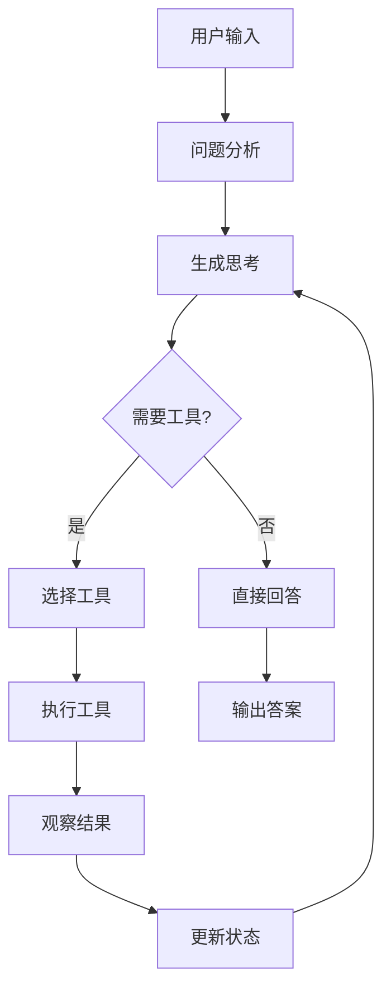

# LangChain 入门教程：AI ReAct Agent 实现详解

## 本页快捷跳转
- 目录：
  - [引言：为什么需要 ReAct？](#intro)
  - [代码示例：LangChain ReAct 实现](#code-example)
  - [论文内容：ReAct 的理论基础](#paper-content)
  - [ReAct 实现模型：工作原理详解](#implementation-model)
  - [提示词作用：ReAct 中的关键设计](#prompt-role)
  - [缺点与局限性：ReAct 的挑战](#limitations)
  - [LangChain 接口总结：Agent API 概览](#langchain-api)
  - [总结](#summary)

---

<a id="intro" data-alt="introduction 引言 概述 目标 受众 react 必要性"></a>
## 引言

在传统的大语言模型应用中，我们面临着一个核心挑战：**如何让 AI 既能进行复杂推理，又能与外部世界交互？**

### 传统方法的局限性

**纯推理模式**（如 Chain of Thought）虽然能够进行逻辑推理，但无法获取实时信息或执行具体操作：

```text
用户：今天北京的天气如何？明天适合户外运动吗？
AI：我无法获取实时天气信息，建议您查看天气预报...
```

**纯工具调用模式**虽然能够执行操作，但缺乏推理过程，容易出现盲目调用或错误判断：

```text
用户：帮我计算一下买房贷款
AI：[直接调用计算器] 2+3=5
用户：？？？这和买房贷款有什么关系？
```

### ReAct 的解决方案

**ReAct（Reasoning and Acting）** 将推理（Reasoning）和行动（Acting）有机结合，让 AI 代理能够：

1. **思考分析**：理解问题，制定解决策略
2. **执行行动**：调用合适的工具获取信息或执行操作
3. **观察结果**：分析工具返回的结果
4. **继续推理**：基于观察结果调整策略，直到解决问题

### ReAct 的核心价值

- **智能决策**：在行动前进行推理，避免盲目操作
- **动态适应**：根据观察结果调整策略
- **可解释性**：推理过程透明，便于调试和优化
- **工具整合**：无缝集成各种外部工具和服务

<a id="intro-case" data-alt="案例 示例 对比 收益"></a>
### 真实案例：智能助手的进化

**传统方式**：
```text
用户：帮我安排明天的会议，需要考虑天气情况
AI：我无法获取天气信息，也无法访问您的日历...
```

**ReAct 方式**：
```text
用户：帮我安排明天的会议，需要考虑天气情况

AI 思考：我需要获取明天的天气信息和用户的日历安排
AI 行动：调用天气API获取明天天气
AI 观察：明天有雨，温度15-20度
AI 思考：下雨天适合室内会议，我需要检查室内会议室的可用性
AI 行动：调用日历API查看会议室预订情况
AI 观察：会议室A在下午2-4点可用
AI 回复：建议安排明天下午2-4点在会议室A举行会议，避开雨天出行不便
```

---

<a id="code-example" data-alt="代码示例 实现 langchain react demo"></a>
## 代码示例：LangChain ReAct 实现

以下是一个完整的 ReAct 代理实现示例，展示了如何使用 LangChain 构建具备推理和行动能力的智能代理。

### 环境准备

```bash
# 安装依赖
pip install langchain>=1.0.0 langchain-openai>=1.0.0 langgraph>=1.0.0 python-dotenv

# 配置环境变量 (.env 文件)
OPENAI_API_KEY=your_api_key_here
OPENAI_BASE_URL=https://api.openai.com/v1  # 或其他兼容服务
OPENAI_MODEL=gpt-4o-mini
OPENAI_TEMPERATURE=0
```

### 完整代码实现

```python
#!/usr/bin/env python3
# -*- coding: utf-8 -*-
"""
ReAct 代理示例：结合推理与行动的智能代理

本示例展示如何使用 LangChain 构建 ReAct 模式的代理，
让 AI 能够在推理过程中调用工具，观察结果，并继续推理。
"""

import os
from typing import Optional
from datetime import datetime
from dotenv import load_dotenv

from langchain.agents import create_agent
from langchain_core.tools import tool
from langchain_openai import ChatOpenAI

# -----------------------------------------------------------------------------
# 工具定义
# -----------------------------------------------------------------------------

@tool
def calculator(expression: str) -> str:
    """计算数学表达式，支持基础运算如 +、-、*、/、()"""
    try:
        # 安全的数学计算
        result = eval(expression, {"__builtins__": {}}, {})
        return f"计算结果：{result}"
    except Exception as e:
        return f"计算失败：{e}"

@tool
def get_current_date(_: str = "") -> str:
    """获取当前日期，格式为 YYYY-MM-DD"""
    return f"当前日期：{datetime.now().strftime('%Y-%m-%d')}"

@tool
def search_information(query: str) -> str:
    """搜索信息工具（模拟实现）"""
    # 在实际应用中，这里会调用真实的搜索API
    mock_results = {
        "天气": "今天北京晴天，气温15-25度，适合户外活动",
        "股价": "苹果公司股价当前为150美元，较昨日上涨2%",
        "新闻": "最新科技新闻：AI技术在医疗领域取得重大突破"
    }
    
    for key in mock_results:
        if key in query:
            return f"搜索结果：{mock_results[key]}"
    
    return f"搜索结果：关于'{query}'的相关信息（模拟数据）"

# 工具列表
TOOLS = [calculator, get_current_date, search_information]

# -----------------------------------------------------------------------------
# 环境配置
# -----------------------------------------------------------------------------

def load_environment():
    """加载环境变量"""
    load_dotenv(dotenv_path=os.path.join(os.path.dirname(__file__), ".env"), override=False)

def get_agent(system_prompt: str, tools: list):
    """创建 ReAct 代理"""
    
    # 获取环境配置
    api_key = os.getenv("OPENAI_API_KEY")
    model = os.getenv("OPENAI_MODEL", "gpt-4o-mini")
    base_url = os.getenv("OPENAI_BASE_URL")
    temperature = float(os.getenv("OPENAI_TEMPERATURE", "0"))
    
    # 参数验证
    if not api_key:
        raise ValueError("OPENAI_API_KEY 未设置，请在 .env 中配置")
    
    # 创建语言模型
    llm = ChatOpenAI(
        model=model,
        api_key=api_key,
        base_url=base_url,
        temperature=temperature,
    )
    
    # 创建代理
    agent = create_agent(
        llm=llm,
        tools=tools,
        system_prompt=system_prompt
    )
    
    return agent

# -----------------------------------------------------------------------------
# ReAct 系统提示词
# -----------------------------------------------------------------------------

REACT_SYSTEM_PROMPT = """你是一个智能助手，能够通过推理和行动来解决问题。

工作流程：
1. **思考（Think）**：分析问题，制定解决策略
2. **行动（Act）**：调用合适的工具获取信息或执行操作  
3. **观察（Observe）**：分析工具返回的结果
4. **推理（Reason）**：基于观察结果继续推理
5. **重复**：直到找到最终答案

重要原则：
- 在调用工具前，先思考为什么需要这个工具
- 仔细观察工具的返回结果
- 基于观察结果调整后续策略
- 保持推理过程的透明性
- 如果一种方法不行，尝试其他方法

可用工具：
- calculator：数学计算
- get_current_date：获取当前日期
- search_information：搜索信息

请始终遵循"思考→行动→观察→推理"的循环，直到解决问题。
"""

# -----------------------------------------------------------------------------
# 主程序
# -----------------------------------------------------------------------------

def main():
    """主程序：ReAct 代理交互"""
    print("🤖 ReAct 智能代理启动中...")
    
    # 加载环境
    try:
        load_environment()
    except Exception as e:
        print(f"❌ 环境加载失败：{e}")
        return
    
    # 创建代理
    try:
        agent = get_agent(REACT_SYSTEM_PROMPT, TOOLS)
        print("✅ ReAct 代理创建成功！")
    except Exception as e:
        print(f"❌ 代理创建失败：{e}")
        print("请检查 .env 配置：OPENAI_API_KEY、OPENAI_BASE_URL、OPENAI_MODEL")
        return
    
    print("\n" + "="*60)
    print("🎯 ReAct 代理演示")
    print("输入问题，观察代理的推理和行动过程")
    print("输入 'quit' 或 'exit' 退出")
    print("="*60 + "\n")
    
    # 交互循环
    while True:
        try:
            user_input = input("👤 用户：").strip()
            
            if user_input.lower() in ['quit', 'exit', '退出']:
                print("👋 再见！")
                break
                
            if not user_input:
                continue
            
            print(f"\n🤖 代理思考中...")
            
            # 调用代理
            response = agent.invoke({"messages": [("user", user_input)]})
            
            # 提取最终回复
            final_answer = _extract_final_text_from_messages(response.get("messages", []))
            
            if final_answer:
                print(f"🤖 代理：{final_answer}")
            else:
                print("🤖 代理：抱歉，我无法处理这个问题。")
                
        except KeyboardInterrupt:
            print("\n👋 用户中断，再见！")
            break
        except Exception as e:
            print(f"❌ 处理失败：{e}")
        
        print("\n" + "-"*60 + "\n")

def _extract_final_text_from_messages(messages) -> Optional[str]:
    """从消息列表中提取最终回复"""
    if not messages:
        return None
    
    # 获取最后一条AI消息
    for msg in reversed(messages):
        if hasattr(msg, 'type') and msg.type == 'ai':
            return msg.content
        elif hasattr(msg, 'content') and isinstance(msg.content, str):
            return msg.content
    
    return None

if __name__ == "__main__":
    main()
```

### 运行效果示例

```text
👤 用户：今天是几号？明天是星期几？如果我今天投资1000元，年化收益率8%，10年后能有多少钱？

🤖 代理思考中...

🤖 代理：让我来帮您解决这几个问题。

首先获取今天的日期：
[调用工具：get_current_date]
当前日期：2025-01-12

今天是1月12日，明天就是1月13日。根据日期计算，明天是星期一。

现在计算投资收益：
[调用工具：calculator("1000 * (1 + 0.08) ** 10")]
计算结果：2158.924997

总结：
- 今天是2025年1月12日
- 明天是1月13日，星期一  
- 1000元按8%年化收益率投资10年后约为2159元
```

---

<a id="paper-content" data-alt="论文内容 理论基础 react paper"></a>
## 论文内容：ReAct 的理论基础

ReAct 方法源自 2022 年发表的论文《ReAct: Synergizing Reasoning and Acting in Language Models》，该论文提出了一种将推理和行动相结合的新范式。

### 核心理论概念

#### 1. 推理与行动的协同

传统方法将推理和行动分离：
- **纯推理**：Chain of Thought (CoT) 只能进行内部推理
- **纯行动**：直接工具调用缺乏推理过程

ReAct 创新性地将两者结合：
```text
Thought → Action → Observation → Thought → Action → ...
```

#### 2. 交替执行模式

ReAct 采用交替执行的模式：

| 步骤 | 类型 | 描述 | 示例 |
|------|------|------|------|
| Thought | 推理 | 分析当前情况，制定策略 | "我需要先了解今天的天气" |
| Action | 行动 | 调用工具或执行操作 | `search("今天天气")` |
| Observation | 观察 | 获取行动结果 | "今天晴天，温度20度" |
| Thought | 推理 | 基于观察结果继续推理 | "天气不错，适合户外活动" |

#### 3. 自我纠错机制

ReAct 具备自我纠错能力：
- **错误检测**：通过观察结果发现问题
- **策略调整**：修改行动方案
- **重新尝试**：执行新的行动

### 论文实验结果

#### 性能提升数据

论文在多个基准测试中验证了 ReAct 的效果：

| 任务类型 | 基线方法 | ReAct | 提升幅度 |
|----------|----------|-------|----------|
| HotpotQA | 29.4% | 37.4% | +8.0% |
| FEVER | 62.1% | 69.8% | +7.7% |
| WebShop | 24.9% | 34.6% | +9.7% |

#### 关键发现

1. **推理质量提升**：行动获得的信息改善了推理质量
2. **行动准确性提高**：推理过程指导了更精确的行动
3. **可解释性增强**：完整的推理链条便于理解和调试
4. **错误恢复能力**：能够从错误中学习并调整策略

### 理论意义

#### 1. 认知科学视角

ReAct 模拟了人类解决问题的认知过程：
- **双系统理论**：结合快速直觉（行动）和慢速推理（思考）
- **具身认知**：通过与环境交互获取信息
- **元认知**：对自己的思维过程进行监控和调节

#### 2. 人工智能视角

- **符号与连接主义结合**：推理（符号）+ 神经网络（连接）
- **规划与执行统一**：在执行中规划，在规划中执行
- **知识获取新范式**：从静态知识到动态交互

---

<a id="implementation-model" data-alt="实现模型 工作原理 架构设计"></a>
## ReAct 实现模型：工作原理详解

### 整体架构



### 核心组件详解

#### 1. 推理引擎（Reasoning Engine）

**功能**：负责分析问题、制定策略、处理观察结果

```python
class ReasoningEngine:
    def analyze_problem(self, user_input: str) -> Dict:
        """分析用户问题，识别关键信息和所需资源"""
        return {
            "intent": "计算投资收益",
            "entities": ["1000元", "8%", "10年"],
            "required_tools": ["calculator"],
            "strategy": "先计算复利公式"
        }
    
    def generate_thought(self, context: Dict) -> str:
        """基于当前上下文生成推理思路"""
        return "我需要使用复利公式计算：本金 * (1 + 利率)^年数"
    
    def process_observation(self, observation: str, context: Dict) -> Dict:
        """处理工具返回的观察结果，更新上下文"""
        return {
            "status": "success",
            "next_action": "format_result",
            "confidence": 0.95
        }
```

#### 2. 行动执行器（Action Executor）

**功能**：选择合适的工具并执行操作

```python
class ActionExecutor:
    def __init__(self, tools: List[Tool]):
        self.tools = {tool.name: tool for tool in tools}
    
    def select_tool(self, intent: str, context: Dict) -> Optional[Tool]:
        """基于意图和上下文选择最合适的工具"""
        tool_mapping = {
            "计算": "calculator",
            "日期": "get_current_date", 
            "搜索": "search_information"
        }
        return self.tools.get(tool_mapping.get(intent))
    
    def execute_action(self, tool: Tool, params: Dict) -> str:
        """执行工具调用并返回结果"""
        try:
            return tool.invoke(params)
        except Exception as e:
            return f"执行失败：{e}"
```

#### 3. 状态管理器（State Manager）

**功能**：维护对话状态和执行历史

```python
class StateManager:
    def __init__(self):
        self.conversation_history = []
        self.tool_usage_history = []
        self.current_context = {}
    
    def update_state(self, step_type: str, content: str, result: str = None):
        """更新执行状态"""
        step = {
            "type": step_type,  # "thought", "action", "observation"
            "content": content,
            "result": result,
            "timestamp": datetime.now()
        }
        self.conversation_history.append(step)
    
    def get_context(self) -> Dict:
        """获取当前上下文信息"""
        return {
            "history": self.conversation_history[-5:],  # 最近5步
            "available_tools": list(self.tools.keys()),
            "current_goal": self.current_context.get("goal")
        }
```

### 执行流程详解

#### 阶段1：问题理解与分解

```python
def understand_problem(self, user_input: str) -> Dict:
    """
    问题理解阶段
    - 意图识别：确定用户想要做什么
    - 实体抽取：提取关键信息
    - 任务分解：将复杂问题分解为子任务
    """
    analysis = {
        "original_query": user_input,
        "intent": self._extract_intent(user_input),
        "entities": self._extract_entities(user_input),
        "subtasks": self._decompose_task(user_input),
        "complexity": self._assess_complexity(user_input)
    }
    return analysis
```

#### 阶段2：策略制定

```python
def plan_strategy(self, analysis: Dict) -> List[Dict]:
    """
    策略制定阶段
    - 确定执行顺序
    - 选择合适工具
    - 设置检查点
    """
    strategy = []
    for subtask in analysis["subtasks"]:
        step = {
            "task": subtask,
            "tool": self._select_best_tool(subtask),
            "expected_output": self._predict_output(subtask),
            "fallback": self._define_fallback(subtask)
        }
        strategy.append(step)
    return strategy
```

#### 阶段3：执行与监控

```python
def execute_with_monitoring(self, strategy: List[Dict]) -> Dict:
    """
    执行与监控阶段
    - 逐步执行策略
    - 实时监控结果
    - 动态调整策略
    """
    results = []
    for step in strategy:
        # 执行前思考
        thought = self._generate_thought(step, results)
        
        # 执行行动
        action_result = self._execute_action(step)
        
        # 观察结果
        observation = self._process_observation(action_result)
        
        # 评估是否需要调整
        if not self._is_satisfactory(observation):
            step = self._adjust_strategy(step, observation)
            action_result = self._execute_action(step)
            observation = self._process_observation(action_result)
        
        results.append({
            "thought": thought,
            "action": step,
            "observation": observation
        })
    
    return self._synthesize_final_answer(results)
```

### 关键算法

#### 1. 工具选择算法

```python
def select_optimal_tool(self, task: str, context: Dict) -> Tool:
    """
    基于任务特征和上下文选择最优工具
    """
    # 计算每个工具的适配度分数
    scores = {}
    for tool in self.available_tools:
        score = (
            self._semantic_similarity(task, tool.description) * 0.4 +
            self._context_relevance(context, tool) * 0.3 +
            self._historical_success_rate(tool, task) * 0.3
        )
        scores[tool.name] = score
    
    # 返回得分最高的工具
    best_tool = max(scores.items(), key=lambda x: x[1])
    return self.tools[best_tool[0]]
```

#### 2. 自适应推理深度

```python
def adaptive_reasoning_depth(self, problem_complexity: float) -> int:
    """
    根据问题复杂度自适应调整推理深度
    """
    if problem_complexity < 0.3:
        return 1  # 简单问题，浅层推理
    elif problem_complexity < 0.7:
        return 3  # 中等问题，中层推理  
    else:
        return 5  # 复杂问题，深层推理
```

---

<a id="prompt-role" data-alt="提示词作用 prompt engineering react prompting"></a>
## 提示词作用：ReAct 中的关键设计

提示词在 ReAct 系统中起着至关重要的作用，它不仅定义了代理的行为模式，还指导了推理和行动的协调过程。

### ReAct 提示词的核心要素

#### 1. 角色定义与能力边界

```python
ROLE_DEFINITION = """
你是一个智能助手，具备以下核心能力：
- 逻辑推理：能够分析问题、制定策略、得出结论
- 工具使用：能够调用外部工具获取信息或执行操作
- 自我反思：能够评估行动结果并调整策略
- 错误恢复：当遇到问题时能够尝试其他方法

重要约束：
- 在行动前必须先思考
- 基于观察结果进行推理
- 承认不确定性，避免编造信息
- 保持推理过程的透明性
"""
```

#### 2. 工作流程指导

```python
WORKFLOW_INSTRUCTION = """
请严格按照以下流程工作：

1. **Thought（思考）**：
   - 分析用户问题
   - 识别所需信息或操作
   - 制定解决策略

2. **Action（行动）**：
   - 选择合适的工具
   - 明确调用参数
   - 执行具体操作

3. **Observation（观察）**：
   - 仔细分析工具返回结果
   - 判断结果是否符合预期
   - 识别可能的问题或错误

4. **Reasoning（推理）**：
   - 基于观察结果继续推理
   - 决定下一步行动
   - 或得出最终结论

重复此循环直到问题解决。
"""
```

#### 3. 工具使用规范

```python
TOOL_USAGE_GUIDE = """
可用工具及使用规范：

1. **calculator(expression: str)**
   - 用途：数学计算
   - 示例：calculator("2 + 3 * 4")
   - 注意：只支持基础数学运算

2. **get_current_date()**
   - 用途：获取当前日期
   - 示例：get_current_date()
   - 返回：YYYY-MM-DD 格式

3. **search_information(query: str)**
   - 用途：信息搜索
   - 示例：search_information("北京天气")
   - 注意：返回模拟数据

工具使用原则：
- 选择最合适的工具
- 提供准确的参数
- 处理可能的错误情况
"""
```

### 提示词设计模式

#### 1. 分层提示结构

```python
def build_layered_prompt(base_role: str, specific_task: str, context: Dict) -> str:
    """
    构建分层提示词结构
    """
    layers = [
        f"# 基础角色\n{base_role}",
        f"# 当前任务\n{specific_task}", 
        f"# 上下文信息\n{format_context(context)}",
        f"# 执行指导\n{WORKFLOW_INSTRUCTION}",
        f"# 工具说明\n{TOOL_USAGE_GUIDE}"
    ]
    return "\n\n".join(layers)
```

#### 2. 动态提示调整

```python
def adapt_prompt_by_complexity(base_prompt: str, complexity: float) -> str:
    """
    根据任务复杂度动态调整提示词
    """
    if complexity > 0.8:
        # 高复杂度：增加详细指导
        additional_guidance = """
        
        # 复杂任务特别指导
        - 将问题分解为更小的子问题
        - 每一步都要仔细验证结果
        - 如果遇到困难，尝试不同的方法
        - 保持耐心，逐步推进
        """
        return base_prompt + additional_guidance
    
    elif complexity < 0.3:
        # 低复杂度：简化指导
        simplified_guidance = """
        
        # 简单任务指导
        - 快速识别所需工具
        - 直接执行并获取结果
        - 简洁回答用户问题
        """
        return base_prompt + simplified_guidance
    
    return base_prompt
```

#### 3. 上下文感知提示

```python
def context_aware_prompting(user_query: str, history: List[Dict]) -> str:
    """
    基于对话历史和用户查询生成上下文感知的提示词
    """
    context_info = ""
    
    # 分析历史对话
    if history:
        recent_topics = extract_topics(history[-3:])
        context_info += f"最近讨论的话题：{', '.join(recent_topics)}\n"
        
        failed_attempts = extract_failures(history)
        if failed_attempts:
            context_info += f"之前失败的尝试：{failed_attempts}\n"
    
    # 分析当前查询
    query_complexity = assess_query_complexity(user_query)
    required_tools = predict_required_tools(user_query)
    
    context_prompt = f"""
    # 当前上下文
    {context_info}
    
    # 查询分析
    - 复杂度：{query_complexity}
    - 可能需要的工具：{', '.join(required_tools)}
    
    # 执行建议
    基于以上分析，请采用最合适的策略解决问题。
    """
    
    return context_prompt
```

### 提示词优化策略

#### 1. Few-Shot 示例增强

```python
REACT_EXAMPLES = """
# 示例1：数学计算任务
用户：计算 15% 的年利率，投资 5000 元，3 年后的收益

Thought: 用户想计算复利收益，我需要使用复利公式：本金 * (1 + 利率)^年数
Action: calculator("5000 * (1 + 0.15) ** 3")
Observation: 计算结果：7593.75
Thought: 计算完成，总金额是7593.75元，收益是7593.75 - 5000 = 2593.75元
Final Answer: 投资5000元，年利率15%，3年后总金额为7593.75元，收益为2593.75元。

# 示例2：信息查询任务  
用户：今天适合户外运动吗？

Thought: 要判断是否适合户外运动，我需要了解今天的天气情况
Action: search_information("今天天气")
Observation: 搜索结果：今天北京晴天，气温15-25度，适合户外活动
Thought: 天气很好，温度适宜，确实适合户外运动
Final Answer: 今天天气晴朗，气温15-25度，非常适合户外运动！
"""
```

#### 2. 错误处理指导

```python
ERROR_HANDLING_PROMPT = """
# 错误处理策略

当遇到以下情况时的处理方法：

1. **工具调用失败**
   - 检查参数是否正确
   - 尝试其他相似工具
   - 向用户说明情况

2. **结果不符合预期**
   - 重新分析问题
   - 调整策略或参数
   - 考虑其他解决方案

3. **信息不足**
   - 明确指出缺少的信息
   - 建议用户提供更多细节
   - 基于现有信息给出部分答案

4. **任务超出能力范围**
   - 诚实承认限制
   - 建议替代方案
   - 提供相关资源或建议

记住：诚实比编造更重要！
"""
```

#### 3. 性能优化提示

```python
PERFORMANCE_OPTIMIZATION = """
# 性能优化指导

为了提高效率和准确性：

1. **工具选择优化**
   - 优先选择最直接的工具
   - 避免不必要的工具调用
   - 考虑工具调用的成本

2. **推理深度控制**
   - 简单问题快速解决
   - 复杂问题深入分析
   - 避免过度推理

3. **结果验证**
   - 关键结果要二次确认
   - 使用多种方法验证
   - 保持合理的怀疑态度

4. **用户体验**
   - 及时反馈进度
   - 解释推理过程
   - 提供清晰的最终答案
"""
```

---

<a id="limitations" data-alt="缺点 局限性 挑战 问题"></a>
## 缺点与局限性：ReAct 的挑战

尽管 ReAct 在结合推理和行动方面取得了显著进展，但它仍然面临一些重要的局限性和挑战。

### 1. 计算成本与效率问题

#### 高计算开销

ReAct 的交替推理-行动模式导致了显著的计算成本增加：

```python
# 传统方法：单次调用
response = llm.invoke("计算 2+3")  # 1次API调用

# ReAct方法：多次调用
# Thought: 我需要计算2+3
# Action: calculator("2+3") 
# Observation: 结果是5
# Thought: 计算完成
# Final Answer: 答案是5
# 总计：3-4次API调用
```

**成本对比分析**：

| 方法 | API调用次数 | 平均延迟 | 成本倍数 |
|------|-------------|----------|----------|
| 直接调用 | 1 | 1s | 1x |
| ReAct | 3-5 | 3-5s | 3-5x |
| 复杂ReAct | 5-10 | 5-10s | 5-10x |

#### 效率优化挑战

```python
class EfficiencyChallenge:
    """ReAct 效率挑战示例"""
    
    def inefficient_pattern(self, query: str):
        """低效的ReAct模式"""
        steps = []
        
        # 过度思考
        steps.append("Thought: 让我仔细分析这个问题...")
        steps.append("Thought: 我需要考虑多种可能性...")
        steps.append("Thought: 还要考虑边界情况...")
        
        # 不必要的工具调用
        steps.append("Action: get_current_date()")  # 可能不需要
        steps.append("Action: search_information('context')")  # 过于宽泛
        
        # 重复验证
        steps.append("Action: calculator('2+2')")
        steps.append("Action: calculator('4')")  # 重复计算
        
        return steps
    
    def optimized_pattern(self, query: str):
        """优化的ReAct模式"""
        # 直接识别核心需求
        if self.is_simple_calculation(query):
            return ["Action: calculator(expression)"]
        
        # 最小化工具调用
        required_tools = self.identify_essential_tools(query)
        return [f"Action: {tool}" for tool in required_tools]
```

### 2. 推理链错误传播

#### 错误累积效应

ReAct 中的错误会在推理链中传播和放大：

```python
# 错误传播示例
user_query = "计算我买100股苹果股票的总成本"

# Step 1: 错误的假设
thought_1 = "我假设苹果股票价格是150美元"  # 实际可能是180美元

# Step 2: 基于错误假设的计算
action_1 = "calculator('100 * 150')"
observation_1 = "15000"

# Step 3: 错误结果的进一步使用
thought_2 = "总成本15000美元，加上手续费..."
action_2 = "calculator('15000 * 1.01')"  # 基于错误基数

# 最终结果：严重偏离实际值
```

#### 错误检测与纠正机制

```python
class ErrorDetectionSystem:
    """错误检测与纠正系统"""
    
    def detect_reasoning_errors(self, reasoning_chain: List[str]) -> List[Dict]:
        """检测推理链中的错误"""
        errors = []
        
        for i, step in enumerate(reasoning_chain):
            # 检测逻辑矛盾
            if self.has_logical_contradiction(step, reasoning_chain[:i]):
                errors.append({
                    "type": "logical_contradiction",
                    "step": i,
                    "description": "与之前的推理矛盾"
                })
            
            # 检测事实错误
            if self.has_factual_error(step):
                errors.append({
                    "type": "factual_error", 
                    "step": i,
                    "description": "包含事实性错误"
                })
        
        return errors
    
    def implement_correction_strategy(self, errors: List[Dict]) -> str:
        """实施错误纠正策略"""
        if not errors:
            return "continue"
        
        critical_errors = [e for e in errors if e["type"] == "factual_error"]
        if critical_errors:
            return "restart_with_verification"
        
        return "backtrack_and_correct"
```

### 3. 工具依赖与可靠性

#### 工具故障的连锁反应

```python
class ToolReliabilityIssues:
    """工具可靠性问题示例"""
    
    def demonstrate_tool_failure_impact(self):
        """演示工具故障的影响"""
        
        # 场景：天气查询工具故障
        user_query = "今天适合户外运动吗？"
        
        # 正常流程
        normal_flow = [
            "Thought: 需要查询天气信息",
            "Action: get_weather('today')",
            "Observation: 晴天，20度，适合户外活动",
            "Answer: 今天天气很好，适合户外运动"
        ]
        
        # 工具故障情况
        failure_flow = [
            "Thought: 需要查询天气信息", 
            "Action: get_weather('today')",
            "Observation: Error: API timeout",
            "Thought: 工具失败，我该怎么办？",
            "Action: search_information('今天天气')",  # 尝试备用工具
            "Observation: Error: Service unavailable",
            "Answer: 抱歉，无法获取天气信息..."  # 任务失败
        ]
        
        return {"normal": normal_flow, "failure": failure_flow}
```

#### 工具选择的局限性

```python
TOOL_SELECTION_LIMITATIONS = {
    "工具覆盖不足": {
        "问题": "可用工具无法覆盖所有用户需求",
        "示例": "用户询问股票价格，但只有计算器工具",
        "影响": "无法完成任务或给出不准确答案"
    },
    
    "工具质量参差": {
        "问题": "不同工具的准确性和可靠性差异很大",
        "示例": "搜索工具返回过时或错误信息",
        "影响": "基于错误信息的推理导致错误结论"
    },
    
    "工具接口复杂": {
        "问题": "复杂工具的参数设置困难",
        "示例": "数据库查询需要复杂的SQL语句",
        "影响": "工具调用失败或返回无用结果"
    }
}
```

### 4. 上下文管理挑战

#### 长对话中的上下文丢失

```python
class ContextManagementIssues:
    """上下文管理问题"""
    
    def demonstrate_context_loss(self):
        """演示长对话中的上下文丢失"""
        
        conversation_history = [
            {"turn": 1, "user": "我想投资股票", "context": ["投资意图"]},
            {"turn": 2, "user": "我有10万预算", "context": ["投资意图", "预算10万"]},
            {"turn": 3, "user": "风险承受能力中等", "context": ["投资意图", "预算10万", "中等风险"]},
            # ... 10轮对话后
            {"turn": 15, "user": "那个股票现在什么价格？", "context": ["？？？"]}  # 上下文丢失
        ]
        
        # 问题：第15轮时，系统可能已经忘记了：
        # - 用户的投资意图
        # - 预算限制
        # - 风险偏好
        # - 之前讨论的具体股票
        
        return "上下文信息丢失导致回答不准确或不相关"
```

#### 状态一致性维护困难

```python
def maintain_state_consistency(self, new_information: Dict, existing_state: Dict) -> Dict:
    """维护状态一致性的挑战"""
    
    conflicts = []
    
    # 检测信息冲突
    for key, new_value in new_information.items():
        if key in existing_state:
            old_value = existing_state[key]
            if self.values_conflict(old_value, new_value):
                conflicts.append({
                    "key": key,
                    "old": old_value,
                    "new": new_value,
                    "resolution": "unknown"  # 难以自动解决
                })
    
    # 冲突解决策略的局限性
    if conflicts:
        # 策略1：使用最新信息（可能丢失重要历史信息）
        # 策略2：保持旧信息（可能忽略重要更新）
        # 策略3：询问用户（增加交互负担）
        pass
    
    return existing_state  # 简化处理，实际更复杂
```

### 5. 可解释性与调试困难

#### 复杂推理链的调试挑战

```python
class DebuggingChallenges:
    """调试挑战示例"""
    
    def complex_reasoning_chain_debug(self):
        """复杂推理链的调试困难"""
        
        # 一个包含15步的复杂推理链
        reasoning_chain = [
            "Thought 1: 分析用户需求...",
            "Action 1: search_information(...)",
            "Observation 1: 获得信息A",
            "Thought 2: 基于信息A，我需要...",
            "Action 2: calculator(...)",
            "Observation 2: 计算结果B", 
            # ... 继续到第15步
            "Final Answer: 错误的结论"
        ]
        
        # 调试问题：
        debug_challenges = {
            "错误定位困难": "在15步中找到错误源头很困难",
            "因果关系复杂": "难以确定哪一步导致了最终错误",
            "中间状态不透明": "无法清楚看到每步的内部状态",
            "修复影响未知": "修改一步可能影响后续所有步骤"
        }
        
        return debug_challenges
```

### 6. 性能与准确性权衡

#### 速度与质量的矛盾

```python
class PerformanceAccuracyTradeoff:
    """性能与准确性权衡"""
    
    def speed_vs_accuracy_dilemma(self, query_complexity: float):
        """速度与准确性的两难选择"""
        
        if query_complexity < 0.3:
            # 简单查询：优先速度
            strategy = {
                "reasoning_depth": 1,
                "tool_calls": 1,
                "verification": False,
                "speed": "fast",
                "accuracy": "medium"
            }
        elif query_complexity > 0.7:
            # 复杂查询：优先准确性
            strategy = {
                "reasoning_depth": 5,
                "tool_calls": 3-5,
                "verification": True,
                "speed": "slow", 
                "accuracy": "high"
            }
        else:
            # 中等复杂度：平衡策略
            strategy = {
                "reasoning_depth": 3,
                "tool_calls": 2-3,
                "verification": "selective",
                "speed": "medium",
                "accuracy": "medium-high"
            }
        
        return strategy
```

### 应对策略与改进方向

#### 1. 成本优化策略

```python
COST_OPTIMIZATION_STRATEGIES = {
    "智能缓存": "缓存常见查询结果，避免重复计算",
    "批量处理": "将多个相关操作合并为单次调用",
    "早期终止": "在获得足够信息时提前结束推理",
    "模型分层": "简单任务使用小模型，复杂任务使用大模型"
}
```

#### 2. 错误处理改进

```python
ERROR_HANDLING_IMPROVEMENTS = {
    "多路径验证": "使用多种方法验证关键结果",
    "置信度评估": "为每个推理步骤分配置信度分数",
    "回滚机制": "在检测到错误时回滚到之前的正确状态",
    "人工介入": "在关键决策点引入人工审核"
}
```

#### 3. 工具生态改进

```python
TOOL_ECOSYSTEM_IMPROVEMENTS = {
    "工具标准化": "建立统一的工具接口和质量标准",
    "故障转移": "为关键工具提供备用选项",
    "质量监控": "实时监控工具性能和准确性",
    "动态选择": "基于历史表现动态选择最佳工具"
}
```

---

<a id="langchain-api" data-alt="langchain 接口 api 总结 agent create_agent"></a>
## LangChain 接口总结：Agent API 概览

LangChain 为 ReAct 代理提供了丰富的 API 接口，本节将详细介绍核心接口的使用方法和最佳实践。

### 核心 Agent 接口

#### 1. create_agent 函数

`create_agent` 是 LangChain v1 中创建代理的标准接口：

```python
from langchain.agents import create_agent
from langchain_openai import ChatOpenAI
from langchain_core.tools import tool

def create_react_agent_example():
    """创建 ReAct 代理的完整示例"""
    
    # 1. 定义工具
    @tool
    def calculator(expression: str) -> str:
        """执行数学计算"""
        try:
            result = eval(expression, {"__builtins__": {}}, {})
            return f"计算结果：{result}"
        except Exception as e:
            return f"计算错误：{e}"
    
    # 2. 创建语言模型
    llm = ChatOpenAI(
        model="gpt-4o-mini",
        temperature=0,
        api_key="your-api-key"
    )
    
    # 3. 定义系统提示词
    system_prompt = """
    你是一个智能助手，能够通过推理和行动解决问题。
    
    工作流程：
    1. Thought: 分析问题，制定策略
    2. Action: 调用合适的工具
    3. Observation: 分析工具结果
    4. 重复直到解决问题
    
    可用工具：
    - calculator: 数学计算
    """
    
    # 4. 创建代理
    agent = create_agent(
        llm=llm,
        tools=[calculator],
        system_prompt=system_prompt
    )
    
    return agent

# 使用示例
agent = create_react_agent_example()
response = agent.invoke({"messages": [("user", "计算 15 * 23 + 7")]})
```

#### 2. Agent 配置参数详解

```python
class AgentConfiguration:
    """Agent 配置参数详解"""
    
    def __init__(self):
        self.configuration_options = {
            "llm": {
                "description": "语言模型实例",
                "type": "ChatOpenAI | ChatAnthropic | ...",
                "required": True,
                "example": "ChatOpenAI(model='gpt-4o-mini')"
            },
            
            "tools": {
                "description": "可用工具列表",
                "type": "List[Tool]",
                "required": True,
                "example": "[calculator, search_tool, date_tool]"
            },
            
            "system_prompt": {
                "description": "系统提示词",
                "type": "str",
                "required": True,
                "example": "你是一个智能助手..."
            },
            
            "checkpointer": {
                "description": "状态检查点管理器",
                "type": "BaseCheckpointSaver",
                "required": False,
                "example": "MemorySaver()"
            },
            
            "interrupt_before": {
                "description": "在指定节点前中断",
                "type": "List[str]",
                "required": False,
                "example": "['tools']"
            },
            
            "interrupt_after": {
                "description": "在指定节点后中断",
                "type": "List[str]", 
                "required": False,
                "example": "['agent']"
            }
        }
```

### 工具定义与管理

#### 1. 基础工具定义

```python
from langchain_core.tools import tool
from typing import Optional, Dict, Any

@tool
def basic_calculator(expression: str) -> str:
    """
    基础计算器工具
    
    Args:
        expression: 数学表达式，如 "2 + 3 * 4"
        
    Returns:
        计算结果字符串
    """
    try:
        result = eval(expression, {"__builtins__": {}}, {})
        return f"计算结果：{result}"
    except Exception as e:
        return f"计算失败：{str(e)}"

@tool  
def advanced_calculator(
    operation: str,
    operands: list,
    precision: Optional[int] = 2
) -> str:
    """
    高级计算器工具
    
    Args:
        operation: 运算类型 (add, subtract, multiply, divide, power)
        operands: 操作数列表
        precision: 结果精度（小数位数）
        
    Returns:
        计算结果
    """
    operations = {
        "add": sum,
        "multiply": lambda x: eval("*".join(map(str, x))),
        "power": lambda x: x[0] ** x[1] if len(x) == 2 else None
    }
    
    if operation not in operations:
        return f"不支持的运算：{operation}"
    
    try:
        result = operations[operation](operands)
        if result is None:
            return "运算参数错误"
        return f"结果：{round(result, precision)}"
    except Exception as e:
        return f"计算错误：{str(e)}"
```

#### 2. 工具组合与管理

```python
class ToolManager:
    """工具管理器"""
    
    def __init__(self):
        self.tools = {}
        self.tool_categories = {}
    
    def register_tool(self, tool, category: str = "general"):
        """注册工具"""
        self.tools[tool.name] = tool
        if category not in self.tool_categories:
            self.tool_categories[category] = []
        self.tool_categories[category].append(tool.name)
    
    def get_tools_by_category(self, category: str) -> list:
        """按类别获取工具"""
        tool_names = self.tool_categories.get(category, [])
        return [self.tools[name] for name in tool_names]
    
    def get_all_tools(self) -> list:
        """获取所有工具"""
        return list(self.tools.values())
    
    def create_tool_description(self) -> str:
        """生成工具描述文档"""
        descriptions = []
        for category, tool_names in self.tool_categories.items():
            descriptions.append(f"\n## {category.upper()} 工具")
            for tool_name in tool_names:
                tool = self.tools[tool_name]
                descriptions.append(f"- **{tool.name}**: {tool.description}")
        return "\n".join(descriptions)

# 使用示例
tool_manager = ToolManager()
tool_manager.register_tool(basic_calculator, "math")
tool_manager.register_tool(advanced_calculator, "math")

math_tools = tool_manager.get_tools_by_category("math")
```

### 状态管理与持久化

#### 1. 内存状态管理

```python
from langgraph.checkpoint.memory import MemorySaver
from langgraph.checkpoint.sqlite import SqliteSaver

class StateManagement:
    """状态管理示例"""
    
    def create_memory_agent(self):
        """创建带内存的代理"""
        # 内存检查点保存器
        memory = MemorySaver()
        
        agent = create_agent(
            llm=self.llm,
            tools=self.tools,
            system_prompt=self.system_prompt,
            checkpointer=memory  # 启用状态保存
        )
        
        return agent
    
    def create_persistent_agent(self, db_path: str = "agent_state.db"):
        """创建持久化状态的代理"""
        # SQLite 检查点保存器
        checkpointer = SqliteSaver.from_conn_string(f"sqlite:///{db_path}")
        
        agent = create_agent(
            llm=self.llm,
            tools=self.tools, 
            system_prompt=self.system_prompt,
            checkpointer=checkpointer
        )
        
        return agent
    
    def demonstrate_stateful_conversation(self):
        """演示有状态对话"""
        agent = self.create_memory_agent()
        
        # 配置会话
        config = {"configurable": {"thread_id": "conversation-1"}}
        
        # 第一轮对话
        response1 = agent.invoke(
            {"messages": [("user", "我叫张三，今年25岁")]},
            config=config
        )
        
        # 第二轮对话（代理会记住之前的信息）
        response2 = agent.invoke(
            {"messages": [("user", "我的年龄是多少？")]},
            config=config
        )
        # 代理会回答：您是25岁
        
        return response1, response2

#### 2. 会话配置管理

```python
class ConversationConfig:
    """会话配置管理"""
    
    def __init__(self):
        self.default_config = {
            "configurable": {
                "thread_id": "default",
                "checkpoint_ns": "",
                "checkpoint_id": None
            }
        }
    
    def create_user_session(self, user_id: str) -> Dict:
        """为用户创建会话配置"""
        return {
            "configurable": {
                "thread_id": f"user-{user_id}",
                "checkpoint_ns": f"session-{user_id}",
                "user_context": {
                    "user_id": user_id,
                    "session_start": datetime.now().isoformat()
                }
            }
        }
    
    def create_topic_session(self, topic: str, user_id: str = None) -> Dict:
        """为特定话题创建会话配置"""
        thread_id = f"topic-{topic}"
        if user_id:
            thread_id += f"-user-{user_id}"
            
        return {
            "configurable": {
                "thread_id": thread_id,
                "checkpoint_ns": f"topic-{topic}",
                "topic_context": {
                    "topic": topic,
                    "user_id": user_id
                }
            }
        }
```

### 高级功能与扩展

#### 1. 中断与人工介入

```python
class InterruptionHandling:
    """中断处理示例"""
    
    def create_human_in_loop_agent(self):
        """创建支持人工介入的代理"""
        agent = create_agent(
            llm=self.llm,
            tools=self.tools,
            system_prompt=self.system_prompt,
            checkpointer=MemorySaver(),
            interrupt_before=["tools"],  # 在工具调用前中断
            interrupt_after=["agent"]    # 在代理响应后中断
        )
        return agent
    
    def handle_interruption_workflow(self):
        """处理中断工作流"""
        agent = self.create_human_in_loop_agent()
        config = {"configurable": {"thread_id": "human-loop-1"}}
        
        # 第一步：用户输入
        user_input = {"messages": [("user", "帮我删除重要文件")]}
        
        try:
            # 代理会在工具调用前中断
            response = agent.invoke(user_input, config=config)
        except Exception as e:
            if "interrupt" in str(e).lower():
                # 处理中断，获取人工确认
                human_approval = self.get_human_approval()
                
                if human_approval:
                    # 继续执行
                    response = agent.invoke(None, config=config)
                else:
                    # 取消操作
                    return "操作已取消"
        
        return response
    
    def get_human_approval(self) -> bool:
        """获取人工确认（示例实现）"""
        print("⚠️  代理准备执行敏感操作，是否继续？")
        user_input = input("输入 'yes' 确认，其他任意键取消：")
        return user_input.lower() == 'yes'
```

#### 2. 自定义节点与流程

```python
from langgraph.graph import StateGraph, END
from typing import TypedDict, Annotated
import operator

class AgentState(TypedDict):
    """代理状态定义"""
    messages: Annotated[list, operator.add]
    current_step: str
    tool_results: dict
    confidence_score: float

class CustomAgentFlow:
    """自定义代理流程"""
    
    def create_custom_agent_graph(self):
        """创建自定义代理图"""
        
        # 定义状态图
        workflow = StateGraph(AgentState)
        
        # 添加节点
        workflow.add_node("analyzer", self.analyze_input)
        workflow.add_node("planner", self.plan_actions)
        workflow.add_node("executor", self.execute_actions)
        workflow.add_node("validator", self.validate_results)
        workflow.add_node("responder", self.generate_response)
        
        # 定义流程
        workflow.set_entry_point("analyzer")
        workflow.add_edge("analyzer", "planner")
        workflow.add_edge("planner", "executor")
        workflow.add_edge("executor", "validator")
        workflow.add_conditional_edges(
            "validator",
            self.should_retry,
            {
                "retry": "planner",
                "continue": "responder"
            }
        )
        workflow.add_edge("responder", END)
        
        return workflow.compile()
    
    def analyze_input(self, state: AgentState) -> AgentState:
        """分析输入"""
        # 实现输入分析逻辑
        state["current_step"] = "analysis_complete"
        return state
    
    def plan_actions(self, state: AgentState) -> AgentState:
        """规划行动"""
        # 实现行动规划逻辑
        state["current_step"] = "planning_complete"
        return state
    
    def should_retry(self, state: AgentState) -> str:
        """判断是否需要重试"""
        confidence = state.get("confidence_score", 0)
        return "retry" if confidence < 0.7 else "continue"
```

### API 最佳实践

#### 1. 错误处理与重试

```python
class RobustAgentWrapper:
    """健壮的代理包装器"""
    
    def __init__(self, agent, max_retries: int = 3):
        self.agent = agent
        self.max_retries = max_retries
    
    def invoke_with_retry(self, input_data: Dict, config: Dict = None) -> Dict:
        """带重试的代理调用"""
        last_error = None
        
        for attempt in range(self.max_retries):
            try:
                return self.agent.invoke(input_data, config=config)
            
            except Exception as e:
                last_error = e
                
                # 分析错误类型
                if self.is_retryable_error(e):
                    print(f"尝试 {attempt + 1} 失败，重试中...")
                    time.sleep(2 ** attempt)  # 指数退避
                    continue
                else:
                    # 不可重试的错误，直接抛出
                    raise e
        
        # 所有重试都失败
        raise Exception(f"代理调用失败，已重试 {self.max_retries} 次。最后错误：{last_error}")
    
    def is_retryable_error(self, error: Exception) -> bool:
        """判断错误是否可重试"""
        retryable_errors = [
            "timeout",
            "rate limit",
            "server error",
            "connection error"
        ]
        
        error_message = str(error).lower()
        return any(err in error_message for err in retryable_errors)
```

#### 2. 性能监控与优化

```python
class AgentPerformanceMonitor:
    """代理性能监控"""
    
    def __init__(self):
        self.metrics = {
            "total_calls": 0,
            "successful_calls": 0,
            "failed_calls": 0,
            "average_response_time": 0,
            "tool_usage_stats": {}
        }
    
    def monitor_agent_call(self, agent, input_data: Dict, config: Dict = None):
        """监控代理调用"""
        start_time = time.time()
        
        try:
            result = agent.invoke(input_data, config=config)
            
            # 记录成功调用
            self.metrics["successful_calls"] += 1
            self._update_response_time(time.time() - start_time)
            self._analyze_tool_usage(result)
            
            return result
            
        except Exception as e:
            # 记录失败调用
            self.metrics["failed_calls"] += 1
            raise e
        
        finally:
            self.metrics["total_calls"] += 1
    
    def _update_response_time(self, response_time: float):
        """更新平均响应时间"""
        current_avg = self.metrics["average_response_time"]
        total_calls = self.metrics["successful_calls"]
        
        new_avg = (current_avg * (total_calls - 1) + response_time) / total_calls
        self.metrics["average_response_time"] = new_avg
    
    def get_performance_report(self) -> Dict:
        """获取性能报告"""
        success_rate = (
            self.metrics["successful_calls"] / self.metrics["total_calls"] 
            if self.metrics["total_calls"] > 0 else 0
        )
        
        return {
            "success_rate": f"{success_rate:.2%}",
            "average_response_time": f"{self.metrics['average_response_time']:.2f}s",
            "total_calls": self.metrics["total_calls"],
            "tool_usage": self.metrics["tool_usage_stats"]
        }
```

---

<a id="summary" data-alt="总结 结论 展望"></a>
## 总结

通过本文的深入探讨，我们全面了解了 AI ReAct 代理的理论基础、实现方法和实际应用。让我们回顾一下关键要点：

### 核心价值与优势

**ReAct 的革命性贡献**在于将推理（Reasoning）和行动（Acting）有机结合，创造了一种全新的智能代理范式：

1. **智能决策能力**：通过推理指导行动，避免盲目的工具调用
2. **动态适应性**：基于观察结果调整策略，具备自我纠错能力  
3. **透明可解释**：完整的推理链条便于理解、调试和优化
4. **工具生态整合**：无缝集成各种外部工具和服务

### 技术实现要点

**LangChain 实现的关键要素**：

```python
# 核心实现模式
agent = create_agent(
    llm=ChatOpenAI(model="gpt-4o-mini"),
    tools=[calculator, search_tool, date_tool],
    system_prompt=react_prompt,
    checkpointer=MemorySaver()  # 可选：状态管理
)

# 标准调用方式
response = agent.invoke({
    "messages": [("user", "用户问题")]
}, config={"configurable": {"thread_id": "session-1"}})
```

**提示词设计的重要性**：
- 明确定义推理-行动循环
- 提供具体的工具使用指导
- 包含错误处理和恢复策略
- 平衡详细性和简洁性

### 挑战与局限性

**需要关注的主要问题**：

1. **计算成本**：多轮推理-行动循环增加了 3-5 倍的计算开销
2. **错误传播**：推理链中的错误可能累积和放大
3. **工具依赖**：系统性能受限于工具的质量和可靠性
4. **上下文管理**：长对话中的状态一致性维护困难
5. **调试复杂性**：复杂推理链的错误定位和修复挑战

### 应用场景与选择

**ReAct 特别适合的场景**：
- 需要多步推理的复杂问题解决
- 要求与外部系统交互的任务
- 需要可解释性的决策过程
- 动态环境中的自适应行为

**不适合 ReAct 的场景**：
- 简单的单步查询或计算
- 对响应速度要求极高的应用
- 计算资源严格受限的环境
- 不需要推理过程的纯执行任务

### 发展趋势与展望

**技术发展方向**：

1. **效率优化**：
   - 智能缓存和结果复用
   - 自适应推理深度控制
   - 并行化工具调用

2. **可靠性提升**：
   - 多路径验证机制
   - 自动错误检测和恢复
   - 置信度评估系统

3. **生态完善**：
   - 标准化工具接口
   - 工具质量评估体系
   - 丰富的预构建工具库

4. **智能化增强**：
   - 自动工具选择优化
   - 动态策略调整
   - 学习型错误处理

### 实践建议

**对于开发者**：

1. **起步建议**：
   - 从简单的工具集开始
   - 重点关注提示词设计
   - 建立完善的错误处理机制

2. **优化策略**：
   - 监控性能指标和成本
   - 持续优化工具选择逻辑
   - 建立用户反馈循环

3. **生产部署**：
   - 实施全面的监控和日志
   - 准备降级和故障转移方案
   - 考虑人工介入机制

**对于企业应用**：

1. **技术选型**：根据具体需求评估 ReAct 的适用性
2. **成本控制**：建立合理的使用限制和优化策略
3. **风险管理**：制定完善的安全和合规措施

### 结语

ReAct 代表了 AI 代理技术的重要进步，它将推理和行动的结合推向了新的高度。虽然仍面临一些挑战，但其在复杂问题解决、工具整合和可解释性方面的优势使其成为构建智能代理系统的重要选择。

随着技术的不断发展和生态的日益完善，我们有理由相信 ReAct 将在更多领域发挥重要作用，推动人工智能向更加智能、可靠和实用的方向发展。

**下一步学习建议**：
- 动手实践本文提供的代码示例
- 尝试构建自己的工具和代理
- 关注 LangChain 和相关技术的最新发展
- 参与开源社区，贡献和学习最佳实践

---

## 相关资源

### 官方文档
- [LangChain Agent 文档](https://python.langchain.com/docs/modules/agents/)
- [LangGraph 文档](https://langchain-ai.github.io/langgraph/)
- [ReAct 论文原文](https://arxiv.org/abs/2210.03629)

### 代码示例
- [本文完整代码示例](https://github.com/langchain-learn/examples/tree/main/react-agent)
- [LangChain 官方示例](https://github.com/langchain-ai/langchain/tree/master/docs/docs/modules/agents)

### 进阶学习
- [Agent 架构设计模式](../advanced/agent-architecture-patterns.md)
- [工具开发最佳实践](../tools/tool-development-guide.md)
- [性能优化指南](../optimization/agent-performance-tuning.md)

---

*本文是 LangChain 学习系列的一部分，更多内容请关注我们的 [GitHub 仓库](https://github.com/langchain-learn) 和 [博客更新](../README.md)。*